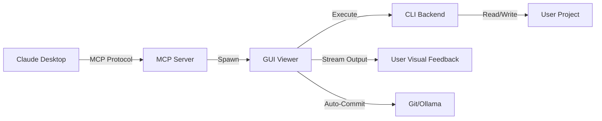

# ClaudeDesktop-ClaudeCode-Bridge


**Bridge Claude Desktop to CLI coding agents with real-time streaming visualization.**

This Model Context Protocol (MCP) server enables Claude Desktop to dispatch complex coding tasks to specialized CLI agents (Claude Code, Gemini CLI, OpenAI Codex) while providing a real-time, color-coded visualization of the execution.

- **Multi-Backend Support**: Seamlessly switch between Claude Code, Gemini CLI, and OpenAI Codex.
- **Real-Time Visualization**: Watch the agent's thought process, tool usage, and file edits live.
- **Auto-Git Workflow**: Automatic commit generation and branch management using local LLMs (Ollama).
- **Godot Integration**: Optional automated project validation for Godot 4.x game development.
- **Safety First**: Runs agents in a separate process with visible output and controlled execution.

## Architecture Overview

The system uses the MCP stdio pattern to expose a single "launcher" tool to Claude Desktop. This tool spawns a detached GUI viewer that wraps the target CLI agent.



## Supported CLI Backends

| CLI | Command Pattern | Default Model | Available Models |
| :--- | :--- | :--- | :--- |
| **Claude Code** | `claude -p ...` | `opus` | `opus`, `sonnet` |
| **Gemini CLI** | `gemini ...` | `gemini-3-pro-preview` | `gemini-2.5-flash`, `gemini-2.5-pro`, `gemini-3-pro-preview` |
| **OpenAI Codex** | `codex exec ...` | `gpt-5-codex` | `gpt-5-codex`, `gpt-5.2-codex` |

## Installation

### Prerequisites
- Python 3.11 or higher
- [Ollama](https://ollama.com/) running locally (for git commit generation)
  - Pull the model: `ollama pull mistral:latest`
- The CLI tools you intend to use (`claude`, `gemini`, etc.) installed and available in your PATH.

### Setup
1. Clone the repository:
   ```bash
   git clone https://github.com/yourusername/claude-code-bridge.git
   cd claude-code-bridge
   ```

2. Install dependencies:
   ```bash
   pip install .
   ```

### Claude Desktop Configuration
Add the server to your Claude Desktop configuration file (e.g., `%APPDATA%\Claude\claude_desktop_config.json` on Windows).

```json
{
  "mcpServers": {
    "claude-code-bridge": {
      "command": "python",
      "args": [
        "path/to/claude-code-bridge/src/server.py"
      ]
    }
  }
}
```

## Usage

When connected, Claude Desktop will have access to the `launch_claude_code` tool. You can ask Claude to "build a feature" or "fix a bug" in a specific project.

### Tool Schema
The tool accepts the following parameters:
- `task`: Detailed description of the work to be done.
- `project_path`: **Exact** absolute path to the project directory.
- `cli`: Backend to use (`claude`, `gemini`, `codex`). Default is `claude`.
- `model`: (Optional) Specific model to use.
- `additional_paths`: (Optional) List of extra directories the agent should have access to.
- `godot_project`: (Optional) Path to a `project.godot` file for validation.

### Example Interaction
**User:** "Can you use Gemini to fix the navigation bug in my React app at C:\Projects\MyApp?"

**Claude:** *Calls `launch_claude_code(task="Fix navigation bug...", project_path="C:\\Projects\\MyApp", cli="gemini")`*

A new window will open on your desktop showing Gemini analyzing the code, running searches, and making edits.

## Git Integration

The bridge includes an automated git workflow to keep your project clean.

- **Auto-Commit**: After a task completes successfully, the system scans for changes.
- **Message Generation**: Uses a local Ollama instance (`mistral:latest`) to generate a Conventional Commit message based on the diff.
- **Branch Management**:
  - If on a `claude/*` branch, it pushes, merges to `main`, and deletes the feature branch.
  - If on `main`, it pushes directly.
  - Generates a sensible `.gitignore` if one is missing.

**Requirement:** Ensure `ollama serve` is running in the background.

## Configuration

### Godot 4.x Validation
To enable automatic Godot project validation:
1. Ensure `Godot.exe` is installed.
2. Pass the `--godot-project <path>` argument or let Claude infer it.
3. The GUI will run Godot in headless mode after the task to check for import or script errors.

*Note: The path to Godot is currently hardcoded in `src/gui_viewer.py`. You may need to update `GODOT_EXE` to match your system.*

## GUI Features

The detached GUI window provides visibility into the "black box" of CLI agents.

- **Color-Coded Stream**:
  - <span style="color:cyan">READ</span>: File reading operations.
  - <span style="color:gold">EDIT</span>: File modification/writing.
  - <span style="color:gold">BASH</span>: Shell command execution.
  - <span style="color:red">ERROR</span>: Failures or stderr output.
- **Live Status**: Shows current action and session status.
- **Summary Panel**:
  - Execution duration.
  - List of modified files.
  - Total tool calls.
  - Validation results (Godot/Linter).

## Development

### Project Structure
```
C:\Projects\ClaudeDesktop-ClaudeCode-Bridge\
├── src\
│   ├── server.py           # Main MCP Entry Point
│   ├── gui_viewer.py       # Tkinter Visualization & CLI Wrapper
│   └── git                # Git Automation Module
│       ├── workflow.py     # Main Git Logic
│       ├── operations.py   # Low-level Git Commands
│       └── commit_message.py # Ollama Integration
├── pyproject.toml          # Project Metadata
└── README.md               # Documentation
```

### Adding a New Backend
To add a new CLI agent:
1. Open `src/gui_viewer.py`.
2. Add a new entry to the `CLI_CONFIGS` dictionary with the command pattern and flags.
3. Implement a format handler (e.g., `_format_line_newcli`) if the CLI outputs a unique JSON structure.

## License

This project is licensed under the MIT License. See the [LICENSE](LICENSE) file for details.
